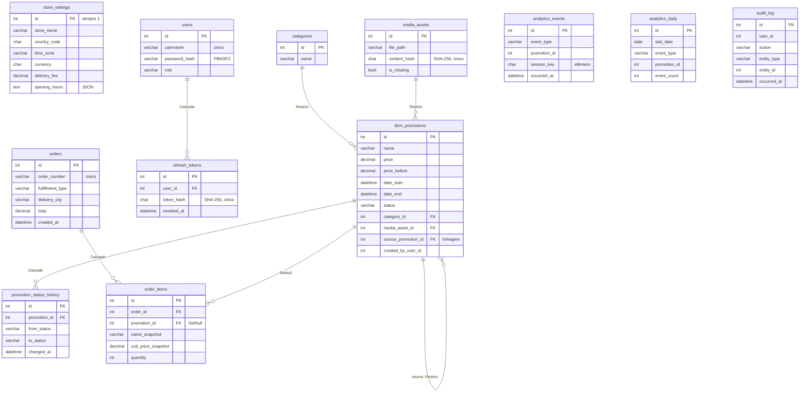

# Modelo de dados

Onze tabelas. As migrations em `backend/Migrations/` são o dono do schema; este
documento explica **por que** cada tabela existe e o que a distingue.

## O que cada tabela resolve

| Tabela | Existe porque |
|---|---|
| `store_settings` | Linha única. Tudo que distinguia uma loja da outra era código; ver [ADR 0005](adr/0005-white-label-antes-de-multi-tenant.md) |
| `categories` | As cinco iniciais são de farmácia; um shop de outro tipo cria as suas pelo admin |
| `media_assets` | Deduplica arquivos por SHA-256 e permite reativar uma promoção sem novo upload |
| `item_promotions` | O item em promoção. `status` substituiu `is_active`; `source_promotion_id` registra a linhagem de reativação |
| `promotion_status_history` | Sem ela, "quando isso saiu do ar e por quê" não tem resposta |
| `users` | Credenciais operacionais do lojista — não são dados de cliente |
| `refresh_tokens` | Guarda só o digest; rotação a cada uso ([ADR 0003](adr/0003-jwt-com-refresh-token-em-cookie.md)) |
| `orders` / `order_items` | Relatório de vendas sem nenhum dado pessoal ([ADR 0002](adr/0002-nenhum-dado-pessoal-no-servidor.md)) |
| `analytics_events` | Funil de conversão. Bruto, retenção curta |
| `analytics_daily` | Agregado diário; os eventos brutos são apagados depois |
| `audit_log` | Quem fez o quê. Só confiável depois da autenticação real |

## Decisões que não são óbvias no schema

**Nenhuma coluna de dado pessoal, em nenhuma tabela.** Não é convenção: é o que
`NoPersonalDataTests` verifica contra o modelo EF mapeado. Adicionar `phone` a
`orders` quebra o build.

**`order_items` guarda snapshots.** `name_snapshot` e `unit_price_snapshot`
duplicam o que estava na promoção no momento da venda. Deliberado: um relatório
histórico tem de mostrar o preço cobrado, não o preço atual — e a FK é `SetNull`,
então a linha continua legível se a promoção desaparecer.

**Comportamento de FK escolhido caso a caso.** `Restrict` onde apagar destruiria
histórico (categoria, media asset, promoção de origem). `Cascade` onde o filho não
existe sem o pai (histórico de status, itens de pedido, refresh tokens). `SetNull`
onde o filho se sustenta sozinho (item de pedido → promoção).

**Defaults de banco não são declarados.** O EF sempre escreve todas as colunas, e
`HasDefaultValue(true)` num bool faria salvar `false` inserir `TRUE`, porque `false`
também é o default do CLR.

**`opening_hours` é `text` com JSON.** É lido inteiro e nunca filtrado; o tipo `json`
do MySQL só adicionaria validação que a API já faz.

**`ix_item_promotions_window`** em `(status, date_start, date_end)` cobre a query
quente da vitrine, que roda em toda página da grade.

**`uq_analytics_daily`** em `(stat_date, event_type, promotion_id)` permite o rollup
fazer upsert idempotente e ser reexecutado sem duplicar.

## Limitação conhecida

`item_promotions` é produto **e** promoção ao mesmo tempo. Consequências: não há
catálogo permanente (só aparece o que está em promoção) e o item é recadastrado a
cada campanha — mitigado por reativar/duplicar, não resolvido. Separar em `Product`
+ `Offer` é migração de dados, planejada em `PLANO_DE_MELHORIAS.md` §6.2.
